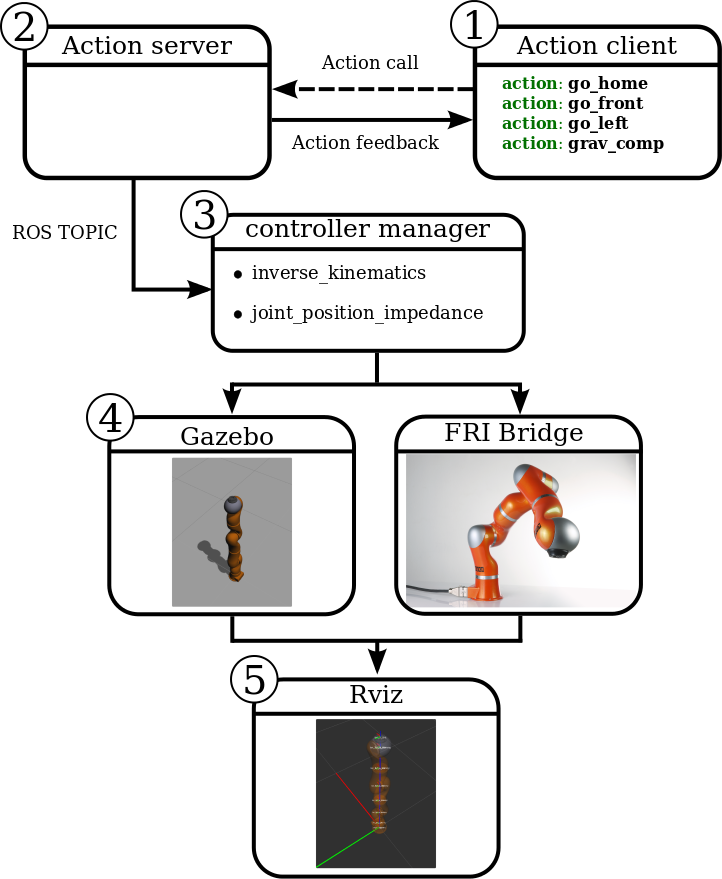

# kuka-lwr-ros
Set of packages for simulating and controlling the KUKA Light Weight Robot (LWR). 

* [**kuka_fri_bridge**](https://github.com/epfl-lasa/kuka-lwr-ros/tree/master/kuka_fri_bridge)         interface and run the physical robot.
  
* [**kuka_lwr**](https://github.com/epfl-lasa/kuka-lwr-ros/tree/master/kuka_lwr)                 contains URDF robot description and hardware interface controllers with configuration files.

* [**kuka_planning_interface**](https://github.com/epfl-lasa/kuka-lwr-ros/tree/master/kuka_planning_interface)  containes action client & server implementation.

* [**robot_motion_generation**](https://github.com/epfl-lasa/kuka-lwr-ros/tree/master/robot_motion_generation)  utilities such as filters for smoothing robot motion.

* [**std_tools_fri**](https://github.com/epfl-lasa/kuka-lwr-ros/tree/master/std_tools_fri)            display console 

Of these packages only the first three are important, the last contain utilities. The dependencies
for this package are

## Dependencies

* [**Gazebo**](http://gazebosim.org/) 
```
$ sudo apt-get install libgazebo6 gazebo6
```
```
$ sudo apt-get install gazebo6
```
* **ROS-Gazebo** dependencies for interfacing ROS and Gazebo
```
$ sudo apt-get install ros-indigo-gazebo6-*
```
* **other ros dependencies**
```
$ sudo apt-get install ros-indigo-joint-trajectory-* ros-indigo-controller-manager* ros-indigo-joint-limits-interface ros-indigo-transmission-interfac
```
* [**fri-library-ros**](https://github.com/epfl-lasa/fri-library-ros) Fast research interface used to communicate 
 with the physical robot.

# Quick Start (Simulation)

Go to your catking workspace folder and git the repository:
```sh
$ git clone git@github.com:epfl-lasa/kuka-lwr-ros.git
```
Rebuild your catking workspace and once everything built properly you are ready to run an example. Open 
a new terminal and run the following:
```sh
$ roslaunch simple_example sim.launch
```
This will run the simulator and the Gazebo simulator and ROS Rviz visualiser GUIs should both open. In the
caption below Rviz is on the left and Gazebo is on the right.


Now that the simulations are up and running we are ready to control the robot. For this we need both the action 
server and client. In two new terminals run the following lines

```sh
$ roslaunch simple_example server.launch
$ roslaunch simple_example client.launch
```

You should have the following triptych view in your console 


Notice on the bottom right console the heading is "KUKA PLANNING INTERFACE" and a prompt **Cmd>**. This is 
the main interface from which you will be starting and stopping policies to be run on the robot. If you
press tab (in this console window) a list of possible actions (robot policies) will be displayed, which in the 
simple example case are; **go_front**, **go_home**,
**go_left**, **grav_comp** and **linear** (note that grav_comp only works on the real physical robot).

# Concept

This package was implemented according to the following design decisions:
*  Seperate user specific policy implementations (search policy, grasping policy, etc..) from the actual robot controllers.
*  User specific policy implementations send desired commands through ROS topics to the actual robot controllers. 

There are a three different interfaces to control the robot those are; 1) position, 2) impedance, and 3) effort.
To reliably control the robot these controllers have to be running at least 1000Hz.  





[**ros_control**](http://gazebosim.org/tutorials?tut=ros_control)  


<ol>
  <li>Action client node</li>
  <li>Action server node</li>
  <li>Controller manager</li>
  <li>Gazebo/Real robot</li>
  <li>Rviz</li>
</ol>
