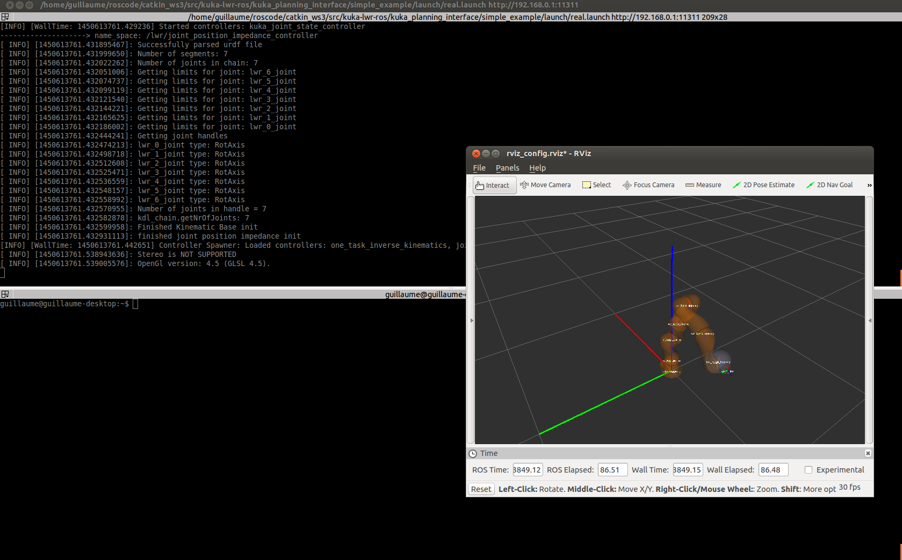
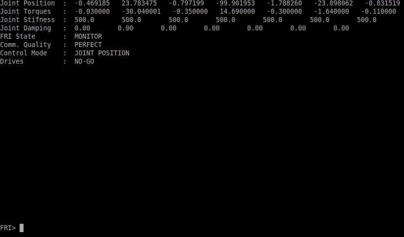
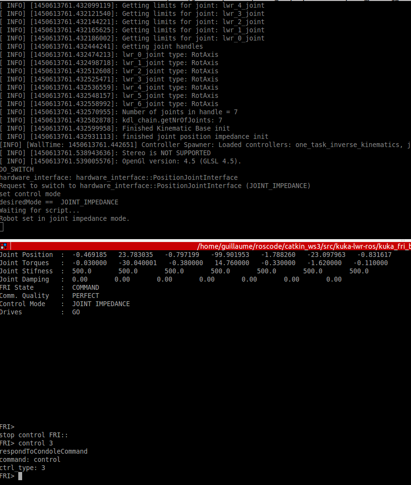

# kuka-lwr-ros
[](https://travis-ci.com/epfl-lasa/kuka-lwr-ros/branches)

# Installation
Do the following steps:
* In your catkin src directory clone the repository
```
$ git clone https://github.com/epfl-lasa/kuka-lwr-ros.git
```
* wstool gets all other git repository dependencies, after the following steps you should see extra catkin 
  packages in your src directory.
```
$  wstool init
$  wstool merge kuka-lwr-ros/dependencies.rosinstall 
$  wstool up 
```
* Query and installs all libraries and packages 
```
$ rosdep install --from-paths . --ignore-src --rosdistro indigo 
```

* Install [**Gazebo**](http://gazebosim.org/), follow this [**link**](http://gazebosim.org/tutorials?tut=install_ubuntu&) for 
instructions on how to install it on ubuntu.

# Description

Set of packages for simulating and controlling the KUKA Light Weight Robot (LWR).

* [**kuka_fri_bridge**](https://github.com/epfl-lasa/kuka-lwr-ros/tree/master/kuka_fri_bridge)         interface and run the physical robot.

* [**kuka_lwr**](https://github.com/epfl-lasa/kuka-lwr-ros/tree/master/kuka_lwr)                 contains URDF robot description and hardware interface controllers with configuration files.

* [**kuka_planning_interface**](https://github.com/epfl-lasa/kuka-lwr-ros/tree/master/kuka_planning_interface)  containes action client & server implementation.

* [**robot_motion_generation**](https://github.com/epfl-lasa/kuka-lwr-ros/tree/master/robot_motion_generation)  utilities such as filters for smoothing robot motion.

* [**std_tools_fri**](https://github.com/epfl-lasa/kuka-lwr-ros/tree/master/std_tools_fri)            display console

Of these packages only the first three are important, the last contain utilities. The dependencies
for this package are


# Quick Start (Simulation)

you are ready to run an example. Open a new terminal and run the following:
```sh
$ roslaunch simple_example sim.launch
```
This will run the simulator and the Gazebo simulator and ROS Rviz visualiser GUIs should both open. If the Gazebo 
window does not open this is because a flag is set in the sim.launch file. In the
caption below Rviz is on the left and Gazebo is on the right.


Now that the simulations are up and running we are ready to control the robot.
In on terminal run the following:
```sh
$ roslaunch simple_example client.launch
```
and in another:
```sh
$ roslaunch simple_example console.launch
```

You should have the following triptych view in your console


Notice on the bottom right console the heading is "KUKA PLANNING INTERFACE" and a prompt **Cmd>**. This is
the main interface from which you will be starting and stopping policies to be run on the robot. If you
press tab (in this console window) a list of possible actions (robot policies) will be displayed, which in the
simple example case are; **go_front**, **go_home**,
**go_left**, **grav_comp** and **linear** (note that grav_comp only works on the real physical robot).

# Quick start (real robot)

Once the robot is turned on and you have loaded your script open the FRI such that in the KUKA interface
 you see the following message: **FRI-Ctrl FRI successfully opened**.

In a terminal run the following:
```sh
$ roslaunch simple_example real.launch
```
You should see an Rviz window with the Robot displayed in the correct configuration.

Now in another terminal run:
```sh
$ roslaunch kuka_fri_bridge fri_console.launch
```
In the terminal you should see the following:


Here you can see all the different state information of the robot. You can notice that
the FRI State is in MONITOR mode which means that you cannot control the robot for the moment.
Next go to this console and press tab.  You will see that a **control** cmd is avaiable.
Now we are going to change the FRI State to COMMAND which will allow use to run the simple
example (see quick start simulation).
In the terminal type the follwoing:
```sh
FRI> control 3
```
In the terminal where you run real.lauch you will see the lign: **Waiting for script...**. This statement means
that you have to press the green button on the KUKA interface panel until you hear a click originating from the robot.
The control 3 cmd sets the robot to **control impedance** mode.



Once this is down you will see in the FRI terminal that the FRI State is now in COMMAND mode and that the
Drives are in state GO.

To send actions to the robot proceed as in Quick start (**simulation**). Essentially open two new terminals and launch
the simple client and server nodes.

# ROS and KUKA Robot network setup

You will need to have either two ethernet network cards on your computer or one ethernet card and
a USB ethernet adaptor. One of the ethernet cards will be connected to the KUKA control box with 
via an ethernet cable. The remaining ethernet card/USB adapater will be used to have access to he 
internet.
Once your two connections are setup, check that you can ping the KUKA robot.
**Robot IP** 192.168.0.2
```
ping 192.168.0.2
```

Now there are two possible setups you might consider; 1) directly connect your PC to the KUKA or 
2) Connect to a hub/switch which then connects to the KUKA control box.

### Direct PC-KUKA control

1) Add a new internet connection with the following information

* Address: 192.168.0.1
* Netmask: 255.255.255.0
* GateWay: 0.0.0.0

2) change the following ROS variables in your .bashrc file:

* export ROS_MASTER_URI=http://192.168.0.1:11311
* export ROS_IP=192.168.0.1

Make sure that your you are networking configuration you setup in 1) and now you should be able 
to use ROS and the KUKA robot.

### PC-HUB-KUKA control

# Useful tips

## KUKA Panel Interface

* If you press FRI OPEN before running the script the communication between your PC and the robot controller
  will be stuck at 50 Hz, until you reboot the KUKA robot PC. To avoid this you should run the script until you
  reach friOpen(2), which will set the communication at 500 Hz. If you want higher you should edit the friOpen script.

# Concept

This package was implemented according to the following design decisions:
*  Seperate user specific policy implementations (search policy, grasping policy, etc..) from the actual robot controllers.
*  User specific policy implementations send desired commands through ROS topics to the actual robot controllers.

There are a three different interfaces to control the robot those are; 1) position, 2) impedance, and 3) effort.
To reliably control the robot these controllers have to be running at least 1000Hz.


[**ros_control**](http://gazebosim.org/tutorials?tut=ros_control)


<ol>
  <li>Action client node</li>
  <li>Action server node</li>
  <li>Controller manager</li>
  <li>Gazebo/Real robot</li>
  <li>Rviz</li>
</ol>
